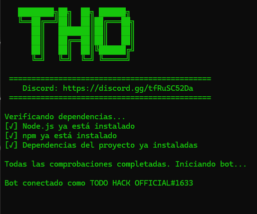
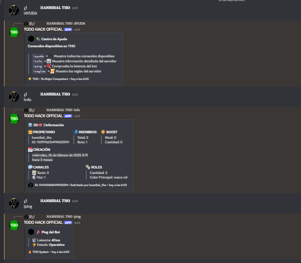

# 🤖 Encender Bot para Discord

<div align="center">
  
  
  
  
</div>

<div align="center">
  <a href="https://discord.gg/tfRuSC52Da">
    
  </a>
  <a href="https://youtu.be/tutorial-id">
    
  </a>
</div>

<div align="center" style="display: flex; justify-content: center; gap: 10px;">
  
  
</div>

## 📋 Características

- ⚡ Sistema de mensajes automáticos
- 🛡️ Comandos del Bot
- 📊 Sistema de información del servidor
- 📜 Reglas personalizables
- 🎨 Embeds profesionales
- 🚀 Fácil de instalar y configurar

## 🔧 Instalación

1. Clona el repositorio
```bash
git clone https://github.com/HANNIBAL-THO/ENCENDER-BOT-DE-DISCORD
```

2. Instala las dependencias
```bash
cd ENCENDER-BOT-DE-DISCORD
npm install
```

3. Configura el archivo `config.json`
```json
{
  "token": "TU_TOKEN_AQUI",
  "prefix": "!",
  "generalChannelId": "ID_DEL_CANAL"
}
```

4. Inicia el bot
```bash
start.bat
```

## 📚 Comandos

- `!ayuda` - Muestra todos los comandos disponibles
- `!info` - Muestra información del servidor
- `!ping` - Comprueba la latencia del bot
- `!reglas` - Muestra las reglas del servidor

## 📝 Licencia

Este proyecto está bajo la Licencia MIT - mira el archivo [LICENSE.md](LICENSE.md) para más detalles.

## 🌟 Créditos

Desarrollado con ❤️ por [ HANNIBAL THO ]

<div align="center">
  <a href="https://discord.gg/tfRuSC52Da">
    
  </a>
</div>
